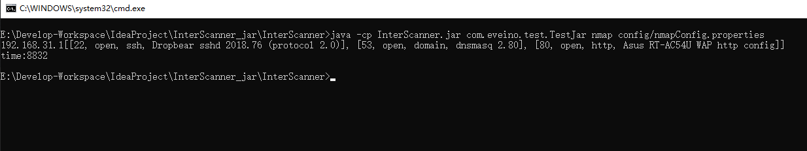

### InterScanner

基于nmap和masscan的小工具，需要提前安装masscan和nmap ^-^
三种工作模式，详细见下文，主要格式化结果输出，并增加多线程

运行环境：jre 1.8

### 三种工作模式

1. masscan
   
   结果：IP:PORTS

   例如：192.168.31.1 [80,8192]

1. nmap
   
   结果：IP:Status

   例如：192.168.31.1[[22, open, ssh, Dropbear sshd 2018.76 (protocol 2.0)], [53, open, domain, dnsmasq 2.80], [80, open, http, Asus RT-AC54U WAP http config]]

1. masscan->nmap，masscan扫完用nmap扫
   
   结果同2，没有mass结果，此时，mass扫完后，会得到开放的端口，一次开一个nmap扫一个端口...会有点慢

### 使用步骤

1. 配置config目录下的target.ip与exclude.ip（单个IP或CIDR）
2. 根据需求，修改config目录下，对应的properties
3. 选择一种工作模式（不重定向结果，则直接打印到终端）

- masscan:
  java -cp InterScanner.jar com.eveino.test.TestJar mass config/massConfig.properties > result/mass.result

- nmap：
  java -cp InterScanner.jar com.eveino.test.TestJar nmap config/nmapConfig.properties > result/nmap.result

- massscan->nmap:
  java -cp InterScanner.jar com.eveino.test.TestJar mass2Nmap config/mass2NmapConfig.properties > result/mass2Nmap.result

### 效果

### 注意事项

所有操作都是在内存中进行，所以不要放太多ip，自己试试吧
